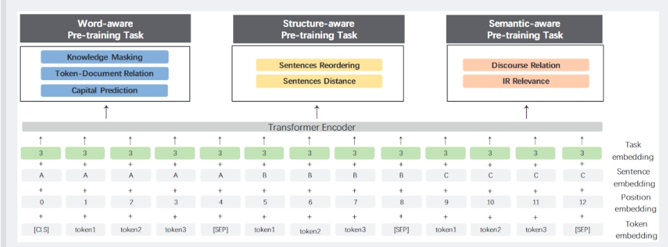

## Emotion Detection Model（Chinese）
In the analysis of Chinese sentiment data sourced from Weibo, the Erlangshen-DeBERTa-v2-320M-Chinese model, as introduced by Zhang et al. (2022) and obtained from IDEA-CNLL, was employed. This model, based on DeBERTa-v2-large and pre-trained on the WuDao Corpora (180 GB version), utilized Whole Word Masking (wwm) in its Masked Language Modeling(MLM) training phase. Zhang et al. (2022) reported a training duration of approximately 7 days using their Fengsheng framework and 8 A100 (80G) GPUs.

DeBERTa, short for “Decoding-enhanced BERT with Disentangled Attention,” was originally proposed by He et al. in 2020 and tailored for Natural Language Understanding (NLU) tasks. The model’s key innovations encompass disentangled attention mechanism and Enhanced mask decoder. The former involves calculating attention scores using both content and position vectors, facilitating the consideration of content-content, content-position, and position-position relationships. The disentangled attention mechanism can be represented mathematically as:

Here, H_i represents content for a token at position i while P_ij denotes relative position with respect to the token at position j. Indeed, an observed phenomenon is that the attentional weight assigned to word pairs is contingent not only upon their semantic content but also on their relative positions within the context. For instance, when words like "deep" and "learning" occur adjacently, their interdependence is notably stronger compared to when they appear in separate sentences.

Alternatively, the enhanced mask decoder involves incorporating absolute position information into the BERT decoder during pre-training. This enables the model to predict masked tokens more accurately. For instance, let's take the sentence "a new store opened beside the new mall" with the words "store" and "mall" masked for prediction. In this scenario, relying solely on local context (i.e., relative positions and surrounding words) proves inadequate for the model to differentiate between "store" and "mall" in the sentence, as both words follow the word "new" with identical relative positions.

DeBERTa-v2 introduces several enhancements compared to its predecessor, including an expanded vocabulary size, an additional convolution layer alongside the first transformer layer to capture local token dependencies, sharing position projection matrix with content projection matrix in attention layer, and employing bucketing to encode relative positions. These modifications contribute to further improving DeBERTa's performance across NLU tasks, including sentiment analysis.

## Emotion Detection Model（English）

In the execution of sentiment detection tasks in English, we will employ Baidu's ERNIE 2.0 pre-trained model. This model is based on the advanced architecture of 'A Continual Pre-Training Framework for Language Understanding,' which allows for the gradual incorporation of various customized tasks. Through this approach, ERNIE 2.0 can continuously engage in multi-task learning, systematically constructing and training a vast array of pre-training tasks. This enables the model to deeply mine all valuable information in the training corpus, whether it be lexical, syntactic, or semantic representations. With such comprehensive learning, ERNIE 2.0 can more accurately identify and process emotional tendencies in texts, thereby enhancing the effectiveness and accuracy of sentiment detection tasks.

The ERNIE 2.0 model encompasses three different language processing tasks: word-aware pre-training task, structure-aware pre-training task, and semantic-aware pre-training task. The specific model architecture is illustrated as follows:

Word-Aware Pre-Training Task: Predicting whether a word in one segment also appears in other segments of the same document. Usually, words that frequently appear in multiple parts of a document are either common words or closely related to the document's main topic.

Structure-Aware Pre-Training Task: This task aims to learn the relationships between sentences. It can also determine the distance between two sentences. Are these sentences adjacent, or not adjacent but in the same document, or are they from different documents.

Semantic-Aware Pre-Training Task: This task aims to predict semantic or rhetorical relationship between two sentences.

### Reference(APA style)
Jiaxing Zhang, Ruyi Gan, Junjie Wang, Yuxiang Zhang, Lin Zhang, Ping Yang, Xinyu Gao, Ziwei Wu, Xiaoqun Dong, Junqing He, Jianheng Zhuo, Qi Yang, Yongfeng Huang, Xiayu Li, Yanghan Wu, Junyu Lu, Xinyu Zhu, Weifeng Chen, Ting Han, Kunhao Pan, Rui Wang, Hao Wang, Xiaojun Wu, Zhongshen Zeng, & Chongpei Chen (2022). Fengshenbang 1.0: Being the Foundation of Chinese Cognitive Intelligence*. CoRR, abs/2209.02970.*

He, P., Liu, X., Gao, J., & Chen, W. (2020). DeBERTa: Decoding-enhanced BERT with Disentangled Attention*. CoRR, abs/2006.03654.*

Yu Sun, Shuohuan Wang, Yukun Li, Shikun Feng, Hao Tian, Hua Wu, & Haifeng Wang. (2019). ERNIE 2.0: A Continual Pre-training Framework for Language Understanding.*
